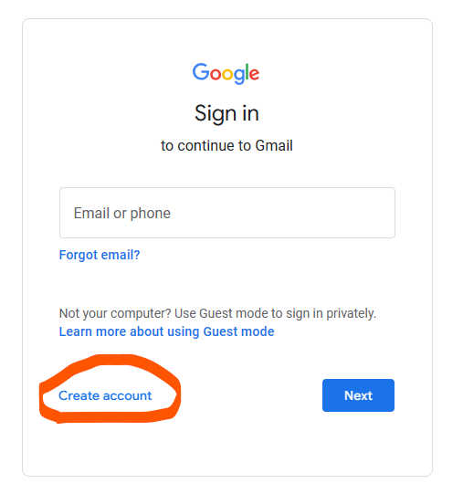
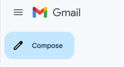
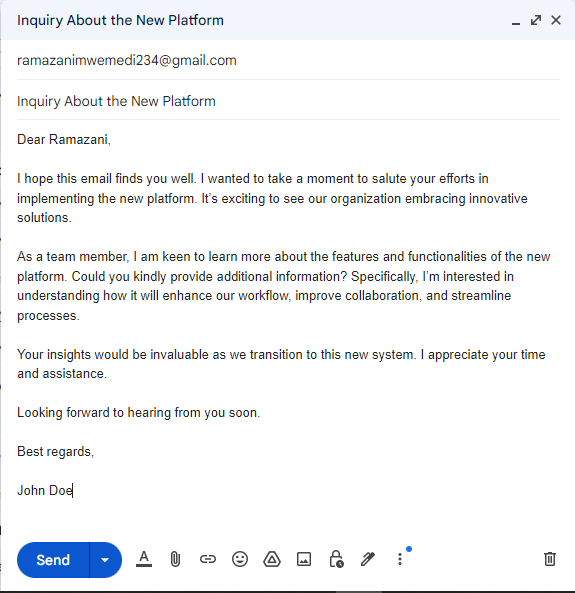

# Email Communication

Email, short for electronic mail, is one of the most widely used forms of communication on the Internet. It allows individuals to send and receive messages electronically, quickly and efficiently. In this section, we'll explore the basics of email communication, including its features, terminology, and advantages.

## What is Email?

Email is a method of exchanging digital messages between people using electronic devices such as computers, smartphones, and tablets. Similar to traditional mail, email messages can contain text, attachments, images, and other types of files.

### Components of an Email

- **Sender**: The person or entity sending the email.
- **Recipient**: The person or group receiving the email.
- **Subject**: A brief summary of the email's content.
- **Body**: The main message of the email.
- **Attachments**: Files or documents attached to the email for sharing additional information.

## How Email Works

When you send an email, your email client (such as Gmail, Outlook, or Yahoo Mail) communicates with an email server, which then delivers the message to the recipient's email server. The recipient can then access the email using their email client.

### Sending an Email

1. Open your email client and click on the "Compose" or "New Email" button.
2. Enter the recipient's email address in the "To" field.
3. Add a relevant subject to the email.
4. Write your message in the body of the email.
5. Optionally, attach files or documents if needed.
6. Click "Send" to deliver the email to the recipient's inbox.

### Receiving and Reading Emails

1. Open your email client or inbox.
2. Click on the email to view its contents.
3. Read the message and any attachments.
4. Reply, forward, or take any other action as necessary.

## Email Terminology

- **Inbox**: The folder where incoming emails are stored.
- **Outbox**: The folder where outgoing emails are temporarily stored before being sent.
- **Drafts**: The folder where unfinished emails are saved.
- **Sent**: The folder where copies of sent emails are stored.
- **Spam**: Unsolicited or unwanted emails, typically filtered by email providers.
- **Attachment**: A file or document attached to an email message.

## Advantages of Email

Email offers numerous advantages over traditional forms of communication:

- **Speed**: Emails are delivered instantly, allowing for rapid communication.
- **Convenience**: Emails can be sent and received at any time, from anywhere with an Internet connection.
- **Cost-Effective**: Sending emails is usually free, saving on postage and paper costs.
- **Record Keeping**: Emails provide a written record of communication, making it easy to refer back to previous conversations.
- **Global Reach**: Email allows for communication with individuals and organizations around the world.

## Best Practices for Email Communication

To make the most of email communication, consider the following best practices:

- **Use Clear and Concise Language**: Keep your emails brief and to the point to ensure clarity.
- **Mind Your Tone**: Be mindful of your tone and use professional language, especially in business settings.
- **Proofread Before Sending**: Double-check your emails for errors in spelling, grammar, and formatting.
- **Respect Privacy**: Avoid sharing sensitive or confidential information via email, and use encryption when necessary.
- **Be Responsive**: Respond to emails promptly, even if it's just to acknowledge receipt.

## Getting Started with Gmail

Gmail is a popular email service provided by Google that allows you to send and receive emails, manage contacts, and organize your inbox. Follow these steps to create a Gmail account and start using Gmail for email communication:

### Creating a Gmail Account

1. **Go to the Gmail Website**: Open your web browser and navigate to the Gmail website [mail.google.com](https://mail.google.com).

2. **Click on "Create Account"**: On the Gmail login page, click on the "Create account" link to begin the account creation process.

3. **Fill Out the Sign-Up Form**: Enter your personal information, including your first and last name, desired email address (username), and password. You'll also need to provide a phone number for account verification and recovery purposes.

4. **Verify Your Phone Number**: Google will send a verification code to the phone number you provided. Enter the code in the verification field to confirm your identity.

5. **Agree to Terms and Conditions**: Review Google's Terms of Service and Privacy Policy, then click on the "I agree" button to proceed.

6. **Complete the Setup**: Follow the on-screen instructions to complete the setup process, including setting up your profile picture and personalizing your Gmail experience.

### Using Gmail for Email Communication

Once you've created your Gmail account, you can start using it to send and receive emails. Here are some key features and actions you can take within Gmail:

### Composing and Sending Emails

1. **Click on "Compose"**: In your Gmail inbox, click on the "Compose" button to start composing a new email.

2. **Enter Recipient**: Enter the email address of the recipient in the "To" field. You can also add additional recipients if needed.

3. **Add Subject and Message**: Enter a subject for your email and compose your message in the body section.

4. **Attach Files (Optional)**: If you want to attach files to your email, click on the paperclip icon and select the files you want to attach from your computer.

5. **Send Email**: Once you've composed your email, click on the "Send" button to send it to the recipient.

### Managing Emails

1. **Inbox**: Your inbox is where you'll receive incoming emails. Click on an email to open and read it.

2. **Labels and Folders**: You can organize your emails using labels and folders. Gmail automatically categorizes emails into primary, social, and promotional tabs, but you can also create custom labels and folders to organize your emails.

3. **Replying and Forwarding**: You can reply to emails by clicking on the "Reply" button, or forward them to other recipients by clicking on the "Forward" button.

4. **Archiving and Deleting**: You can archive emails to remove them from your inbox without deleting them permanently. To delete emails permanently, click on the "Delete" button.

### Additional Features

Gmail offers several additional features to enhance your email communication experience, including:

- **Contacts**: Manage your contacts and create contact groups for easy emailing.
- **Calendar Integration**: Sync your Gmail account with Google Calendar to manage appointments and events.
- **Filters and Rules**: Create filters and rules to automatically organize incoming emails based on specific criteria.
- **Settings and Customization**: Customize your Gmail settings to suit your preferences, including email signature, theme, and layout.

With these features and capabilities, Gmail provides a powerful and user-friendly platform for email communication and organization.
