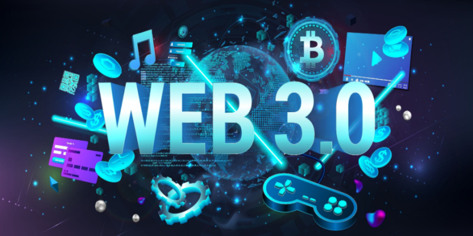

# Computer and Communication

Welcome to the world of computers and communications! In this chapter, we'll explore the fundamental concepts and technologies that form the backbone of modern computing and connectivity.

## Computer Networks

Let's begin by understanding what computer networks are and how they work. A computer network is essentially an interconnected system of two or more computers, allowing them to share information and resources. Think of it as a digital highway that facilitates communication and collaboration between devices.

## Local Area Network (LAN) & Wide Area Network (WAN)

Within a specific location like a building or campus, computers can be connected to form a Local Area Network (LAN). This setup enables seamless sharing of files, printers, and other resources among users within the same physical space.

On a broader scale, computers located in different geographical locations can be connected via telecommunication systems to create a Wide Area Network (WAN). WANs extend connectivity beyond the confines of a single building or campus, enabling communication over vast distances.

## Advantages of Networks

The benefits of computer networks are manifold:

- Efficient resource sharing: Users can access shared files, printers, and applications from any connected device, promoting collaboration and productivity.
- Centralized data storage: Data can be stored on central servers and accessed by authorized users, ensuring data consistency and security.
- Streamlined communication: Email, messaging, and video conferencing services facilitate seamless communication between network users, regardless of their physical location.

## Introduction to the Internet

Now, let's delve into the fascinating world of the Internet. The Internet is a global network of interconnected computers, enabling the exchange of information and services on a global scale. It has revolutionized how we access information, communicate with others, and conduct business.

### The World Wide Web

The World Wide Web (WWW) is a subset of the Internet that consists of interconnected web pages hosted on servers worldwide. These web pages contain a wealth of information on virtually every topic imaginable, ranging from educational resources to entertainment content.

Requirements for Connecting to the Internet

To access the Internet, you'll need the following:

- Internet service provider (ISP): An ISP provides you with a connection to the Internet and the necessary software to navigate online.
- Telecommunication line: A telephone line or broadband connection is required to establish a connection to your ISP.
- Modem: A modem is a device that converts digital signals from your computer into analog signals for transmission over telephone lines and vice versa.
- Web browser: A web browser is software that allows you to view and interact with web pages on the Internet. Popular web browsers include Google Chrome, Mozilla Firefox, and Microsoft Edge.

## Common Internet Services

Now that we've covered the basics of Internet connectivity, let's explore some common Internet services that enhance our online experience.

### Web Browsing

Web browsing allows users to access and navigate websites on the Internet using a web browser. Users can search for information, read articles, watch videos, and interact with web-based applications.

### Online Search

Search engines like Google, Bing, and Yahoo enable users to search for information on the Internet using keywords or phrases. Search results provide links to relevant websites and resources based on the user's query.

### Social Media

Social media platforms like Facebook, Twitter, and Instagram connect users worldwide, allowing them to share updates, photos, and videos with friends and followers. Social media also facilitates communication and collaboration among users with shared interests.

### Online Streaming

Streaming services like Netflix, YouTube, and Spotify enable users to watch movies, TV shows, and listen to music online. Users can access a vast library of content on-demand, anytime, and anywhere with an Internet connection.

### Online Shopping

E-commerce websites like Amazon, eBay, and Walmart allow users to shop for goods and services online. Users can browse products, compare prices, and make purchases securely using various payment methods.

### Online Banking

Online banking services provided by banks and financial institutions allow users to manage their accounts, transfer funds, pay bills, and access financial information securely over the Internet.

## Evolution of the Internet: Web 1.0, Web 2.0, and Web 3.0

Let's take a closer look at the evolution of the Internet and its impact on how we interact with information and services online.

### Web 1.0: The Beginning of the Internet

Web 1.0 emerged with the invention of the Internet and featured static web pages that could only be viewed. These early websites served as digital brochures, with limited interactivity and no ability for users to contribute content. This era saw the rise of early browsers such as Mosaic and Netscape Navigator, which made it easier for users to access the Web.

### Web 2.0: The Era of Social Media and User-Generated Content

Web 2.0, which emerged during the “Internet Boom” era of the late 1990s and early 2000s, introduced more dynamic web pages and websites, and allowed for user-generated content. This era saw the rise of social media platforms such as Facebook, Twitter, and YouTube, as well as the introduction of blogs, wikis, and other forms of user-generated content.

### Web 3.0: The Future of the Internet

Web 3.0, still in development, promises to bring a more personalized and intuitive experience for users. It is expected to be more intelligent and able to understand the context and intent of the user’s actions. This will be achieved through the integration of Artificial Intelligence (AI) and Machine Learning (ML) technologies.

Many experts in the tech industry claim that Web 3.0 is the next evolution of the internet, focusing on decentralization, intelligence, and security. It aims to create a more personalized, intuitive, and inclusive experience for users by leveraging new technologies such as blockchain and artificial intelligence. The goal of Web 3.0 is to make the internet more democratic, open-source, and secure.
