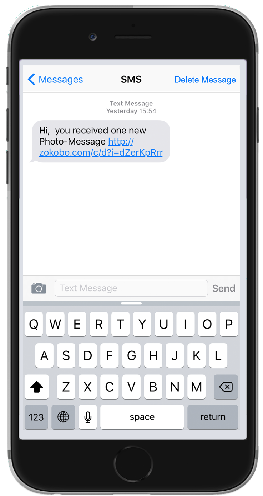
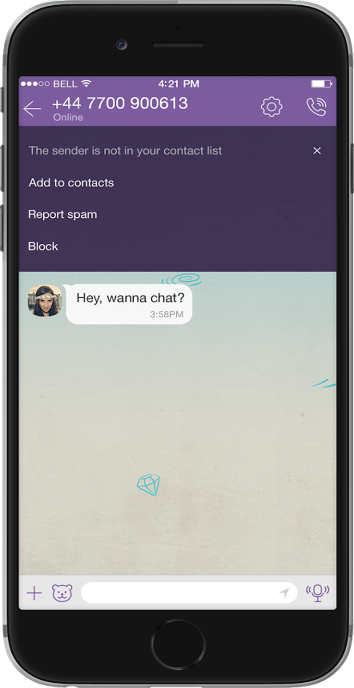

# Safeguarding Your Online Experience: Navigating Internet Safety

The internet serves as a vast and dynamic platform for exploration, learning, and connectivity. While it offers countless opportunities for entertainment and social interaction, it's essential to remain vigilant and aware of potential risks and threats that lurk in the digital realm. Let's delve into key strategies for ensuring a safer online experience.

## Understanding Internet Risks

The internet presents a myriad of risks and challenges, including scams, identity theft, cyberbullying, and exposure to inappropriate content. As users navigate the digital landscape, they must be equipped with the knowledge and skills to protect themselves from potential harm.

## Mitigating Online Threats

### Scenario: Dealing with Unknown Messages

Imagine receiving a message from an unfamiliar number, as depicted below:

What action would you take?

- Click the link
- Delete the message
- Reply

By choosing to delete the message, you've taken a proactive step to safeguard your privacy and security. Deleting unknown messages helps prevent further communication and minimizes the risk of potential scams or phishing attempts.

### Trusting Online Interactions

It's crucial to exercise caution when interacting with individuals online, as not everyone may have genuine intentions. Here are some essential tips to keep in mind:

- **Be Skeptical**: Remain vigilant and skeptical of unsolicited messages or offers, especially from unknown sources. Scammers often use deceptive tactics to lure unsuspecting individuals into fraudulent schemes.

- **Avoid Surprise Wins**: Be wary of offers that promise unexpected prizes or financial rewards, especially if they require upfront payments or personal information. Legitimate lotteries or competitions do not require such practices.

- **Protect Personal Information**: Safeguard your personal information and avoid sharing sensitive details with strangers online. Be cautious of requests for financial information, passwords, or other private data.

### Responding to Unknown Contacts

Consider the scenario below, where you receive a message from an unfamiliar individual:

What action would you take in response?

- Reply and befriend the stranger
- Ignore the stranger
- Block the stranger from contacting you again

By choosing to ignore or block the unfamiliar contact, you're prioritizing your safety and security online. Avoid befriending strangers or engaging in interactions with individuals whose intentions are unclear.
